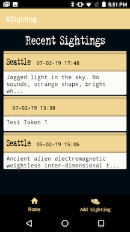
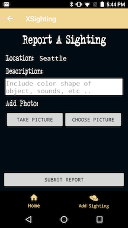
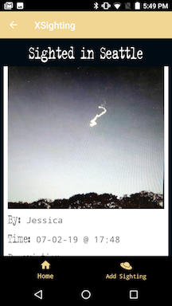
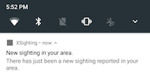

# XSighting


There’s light. It’s blue. You were asleep and don’t think anything of it at first but as you drift back into consciousness you wonder, ‘Why is it blue?’ You shield your still-adjusting eyes from the light and glance at the clock. It’s only 2:00 am. Your mind is still waking and thoughts are coming slowly. The light isn’t coming from inside the room. You throw off the covers and creep towards your window. Your rising fear is temporarily outmatched by your curiosity as you part the blinds just enough to peek out. Nobody is going to believe you. You wouldn't believe you. If only you had a way to tell everyone…

An Android Application, for the UFO community to document and share their UFO sightings. **A Code Fellows 401 Java Team Project**

- [User Stories](https://gist.github.com/evanslaton/c3e272dbf7c0745f37f700df1de534ab)

## The Application
### Features
Name | Description
---- | -----------
Create Sighting | Any logged in user can create a sighting. A sighting has a pre-filled location, and time.
Detail View of Sighting | Shows more details of a sighting, including: author of the sighting, a longer description, timestamp, location, and images--if included.
Delete Sighting | The author of a sighting can delete any sighting they created.
View All Sightings | Any logged in user can view a snippet of a sighting in a larger list of sightings on the main page.
Upload An Image | When creating a sighting a user can take a photo or upload a photo to a sighting upon creation of a sighting.
Notifications | When a sighting is created, all users will receive a notification for the sighting.

### Screenshots





## Instructions for Use
### Installing the APK On Your Phone
1. Go to [Release Page](https://github.com/XSighting/XSighting-Android/releases)
2. The latest release is announced on top. Scroll to the bottom of the release announcement to see the downloads
3. Install the OS appropriate packages. 
4. Move the downloaded ZIP file into your designated local directory
5. Extract the ZIP file and its content into the same local directory
6. Run the `app-debug.exe` file


### Cloning Locally to Your Computer
1. Run `git clone https://github.com/XSighting/XSighting-Android.git` in your terminal.
2. Then `cd XSighting-Android/` into the directory.
3. Open a new **Android Studios** project.
4. Navigate to the directory:` XSighting-Android`.
5. In your application `build.gradle` file, make sure you have the following dependencies:
  ```implementation fileTree(dir: 'libs', include: ['*.jar'])
  implementation 'androidx.appcompat:appcompat:1.1.0-alpha01'
  implementation 'androidx.constraintlayout:constraintlayout:2.0.0-alpha3'
  implementation 'com.google.android.material:material:1.0.0-beta01'
  implementation 'com.google.firebase:firebase-core:16.0.7'

  // Cloud Firestore
  implementation 'com.google.firebase:firebase-firestore:18.0.0'
  implementation 'com.firebaseui:firebase-ui-firestore:4.3.1'

   // Google Play - Location
  implementation 'com.google.android.gms:play-services-location:16.0.0'

  // Firebase Authentication
  implementation 'com.firebaseui:firebase-ui-auth:4.3.1'

  // Firebase Cloud Storage
  implementation 'com.google.firebase:firebase-storage:16.0.5'

  // FirebaseUI Storage
  implementation 'com.firebaseui:firebase-ui-storage:4.1.0'

  // https://github.com/bumptech/glide
  implementation ("com.github.bumptech.glide:glide:4.8.0") {
      exclude group: "com.android.support"
  }

  implementation 'com.android.support:support-fragment:28.0.0'
  annotationProcessor 'androidx.annotation:annotation:1.0.1'
  annotationProcessor 'com.github.bumptech.glide:compiler:4.8.0'

  // Firebase Cloud Messaging
  implementation 'com.google.firebase:firebase-messaging:17.3.4'

  // Testing
  testImplementation 'junit:junit:4.12'
  androidTestImplementation 'androidx.test:runner:1.1.2-alpha01'
  androidTestImplementation 'androidx.test.espresso:espresso-core:3.1.2-alpha01'

  // Added for Espresso testing
  androidTestImplementation 'com.android.support.test:rules:1.0.2'

  // set up espresso
  androidTestImplementation 'com.android.support.test:runner:1.0.2'
  androidTestImplementation 'com.android.support.test.espresso:espresso-core:3.0.2'

// include espresso-intents
  androidTestImplementation 'com.android.support.test.espresso:espresso-intents:3.0.2'
  ```

6. You also need a `google-services.json` file from firebase in the `app` folder. **Make sure you put this file in your `.gitignore` file!!** (so this might not work because you don't have our `.json` file. :woman_shrugging:)

7. First build the application from the CLI using: `./gradlew build`.
8. Run the application from the CLI using: `./gradlew bootrun`.

## Accessibility Scanner Report
### View Reports:
* [Accessibility Report 02/07/2019](assets/accessibility_report/accessibility_report_0202219)

## Credits, Sources, & Technologies
### Technologies:
Android Studios, Java, Firebase Services, Google Play, Glide, Espresso Testing, Git, GitHub
### Images:
* [Image upload and camera permissions](https://stackoverflow.com/questions/32052587/android-studio-permissions-for-image-upload)
* [Getting images from user's gallery](https://stackoverflow.com/questions/5309190/android-pick-images-from-gallery)
* [Getting image file names/paths](https://stackoverflow.com/questions/3401579/get-filename-and-path-from-uri-from-mediastore)
* [Inspired by NJCrain](https://github.com/NJCrain/health-tracker/blob/master/app/src/main/java/com/njcrain/android/healthtracker/activity/ProfileActivity.java)
* [Android docs - camera basic](https://developer.android.com/training/camera/photobasics)
* [Android docs - requesting permissions](https://developer.android.com/training/permissions/requesting)
* [Firebase upload files](https://firebase.google.com/docs/storage/android/upload-files)
* [Firebase download files](https://firebase.google.com/docs/storage/android/download-files)

### Glide:
  * [Glide docs](http://bumptech.github.io/glide/doc/download-setup.html)
  * [Glide GitHub](https://github.com/bumptech/glide)
  * [Firebase UI Storage with Glide](https://github.com/firebase/FirebaseUI-Android/blob/master/storage/README.md)

### Miscellaneous:
* UFO Icon: Sci Fi by Alina Oleynik from the [Noun Project](https://thenounproject.com/)
* [Bottom Navigation Bar](https://guides.codepath.com/android/Bottom-Navigation-Views)
* [Fragments](https://www.androidhive.info/2017/12/android-working-with-bottom-navigation/)
* [Fragments with Firebase](https://medium.com/@dekoservidoni/realtime-chats-with-firebase-in-android-a2a131f94e0c)
* [Fragments multiple onClicks](https://stackoverflow.com/questions/35788127/multiple-buttons-in-fragment-how-to-redirect-to-a-different-layout)
* [Firestore adapter](https://codinginflow.com/tutorials/android/firebaseui-firestorerecycleradapter/part-3-firestorerecycleradapter)
* [Text Appearance](https://gist.github.com/webserveis/c8c7e001c617829caa61dae385113e00)
* [Date Format](https://docs.oracle.com/javase/7/docs/api/java/text/SimpleDateFormat.html)

## The Team
[Jessica Lovell](https://github.com/JessLovell) | [Jeff Borda](https://github.com/jeffborda) | [Derrick Hwang](https://github.com/derrickhwang21) | [Evan Slaton](https://github.com/evanslaton)

## Changelog
2/17/19 - Changed layout structure to fragments
